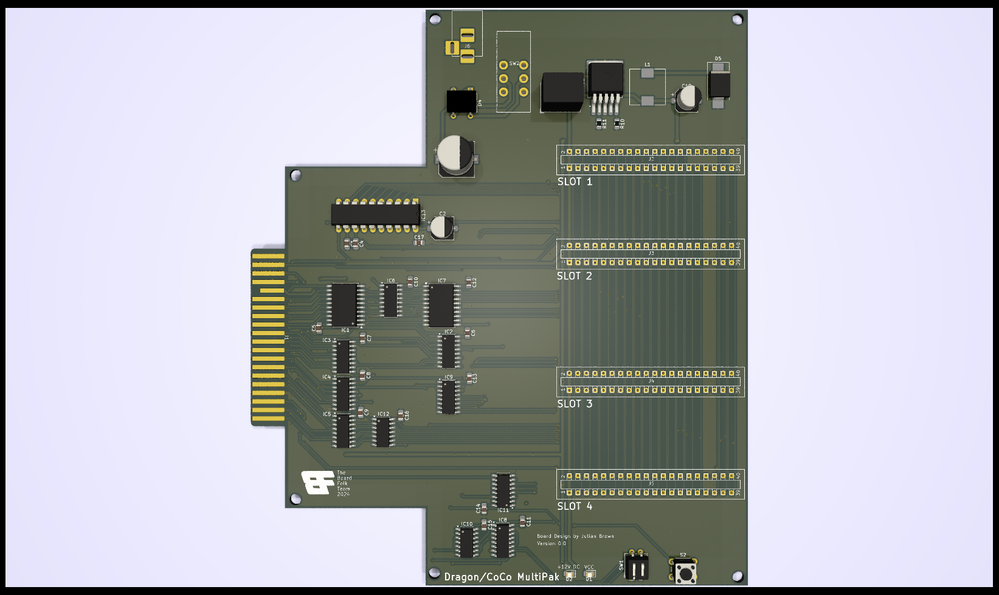

# Dragon MultiPak Interface #

This repository contains the designs for a Dragon 32/64
multipak interface based closely on the TRS-80 Color 
Computer multipak system.

The board allows up to four expansion cartridges to be
connected instead of the normal single slot.

