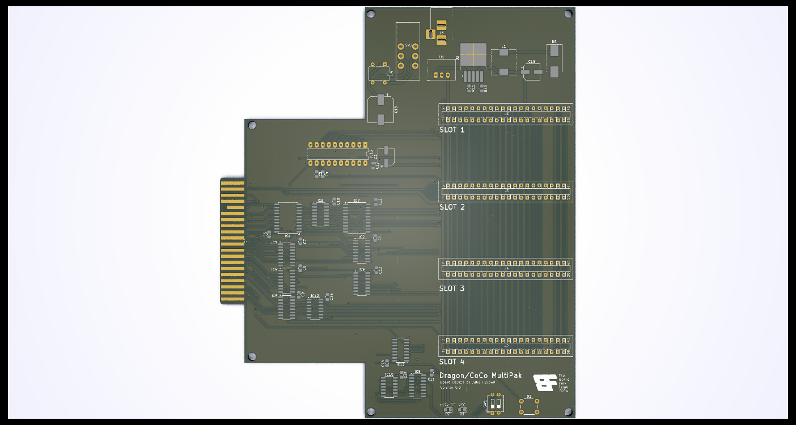

# Dragon MultiPak Interface #

This repository contains the designs for a Dragon 32/64
multipak interface based closely on the TRS-80 Color 
Computer multipak system.

The board allows up to four expansion cartridges to be
connected instead of the normal single slot.

The original CoCo MultiPak is a poor fit with the 
Dragon, this design slims down the interface to
ensure it will work with the Dragon cartridge port.

The CoCo also includes a -5V rail connection which
the Dragon substitutes with an additional +12V rail.
Both cartridge pins are unconnected in this design
as a precaution

## Power Supply ##

For casual use the +5V supplied by the Dragon PSU
should suffice but could become marginal under load.
This board includes an independent power supply that
can supplement the 5V current supply, or even run a
modified Dragon board if additional voltages are not
required.

The power board requires either a 12-15V AC input or
a 15-18V DC input (polarity of the connector is not
important). If 12V is not required (or critical) a 
lower rated DC power adapter can be used.

By default the 12V rail is rated at 0.5A but the 
DC-DC converter on the board can easily be swapped
for a higher rated compatible component.

## GAL Programming ##

A comprehensive set of source definitions for the 
GAL 16V8 chip at IC13 are available on github:
https://github.com/TheLittleEngineers/CoCoDragon-MultiPakInterface-CC-Multi-Pak_Version_1.2/tree/master/PAL_GAL

The GAL programs have been tested for use in a
CoCo but not with a Dragon - memory mapping should
be compatible so no issue is envisaged

Until testing is completed and the programming
conirmed the GAL programs should be treated as untried
in this context.